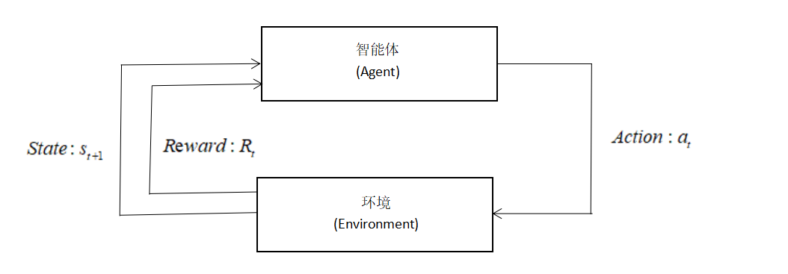

# 基本概念介绍
前面已经介绍过，强化学习难入坑的的原因之一就在于概念繁多。下面将进行基本概念的介绍，本章节最好能够理解，不理解也没有关系，但是建议作为参考章节常看常新。后续章节不理解某个概念时，便回来看看，相信一定能够做到常看常新、从而加深你对于概念的理解。下面将进行三个部分的介绍，分别为强化学习的基本过程、强化学习的基本要素、强化学习的目标。

## 强化学习的基本过程
前面已经介绍过强化学习的核心过程，在于智能体与环境进行交互，通过给出的奖励反馈作为信号学习的过程。简单地用图片表示如下：

正是在这个与环境的交互过程中，智能体不断得到反馈，目标就是尽可能地让环境反馈的奖励足够大。

## 强化学习的基本要素
为了便于理解，我们引入任天堂经典游戏——[新超级马里奥兄弟U](https://www.nintendoswitch.com.cn/new_super_mario_bros_u_deluxe/pc/index.html)，作为辅助理解的帮手。作为一个2D横向的闯关游戏，它的状态空间和动作空间无疑是简单的。

1.智能体(Agent):它与环境交互，可以观察到环境并且做出决策，然后反馈给环境。在马里奥游戏中，能操控的这个马里奥本体就是智能体。

2.环境(Environment):智能体存在并且与其交互的世界。新超级马里奥兄弟U本身，就是一个环境。

3.状态(State)：对环境当前所处环境的全部描述，记为 $S$。在马里奥游戏中，上面的这张图片就是在本时刻的状态。

4.动作(Action):智能体可以采取的行为，记为 $a$。在马里奥游戏中，马里奥能采取的动作只有：上、左、右三个。这属于**离散动作**，动作数量是有限的。而在机器人控制中，机器人能采取的动作是无限的，这属于**连续动作**。

5.策略(Policy):智能体采取动作的规则，分为**确定性策略**与**随机性策略**。确定性策略代表在相同的状态下，智能体所输出的动作是唯一的。而随机性策略哪怕是在相同的状态下，输出的动作也有可能不一样。这么说有点过于抽象了，那么请思考这个问题：在下面这张图的环境中，如果执行确定性策略会发生什么？

