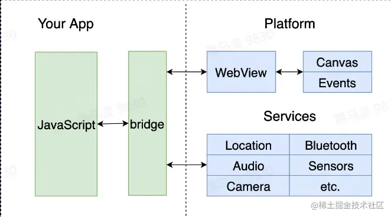
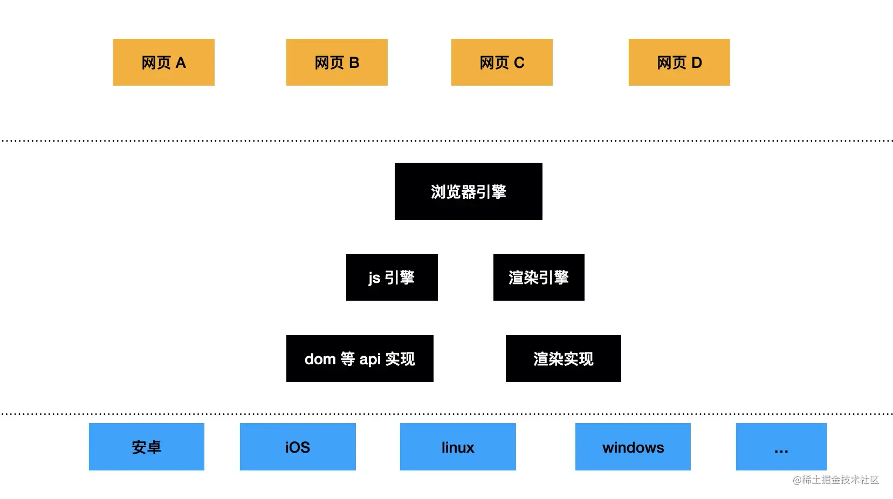
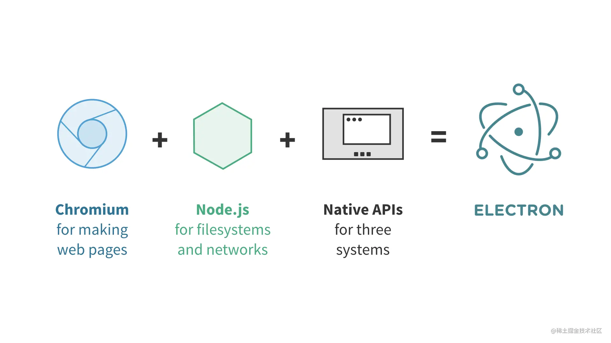
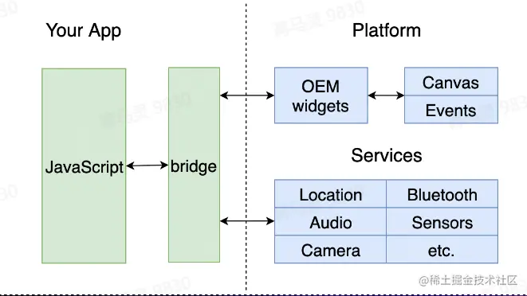
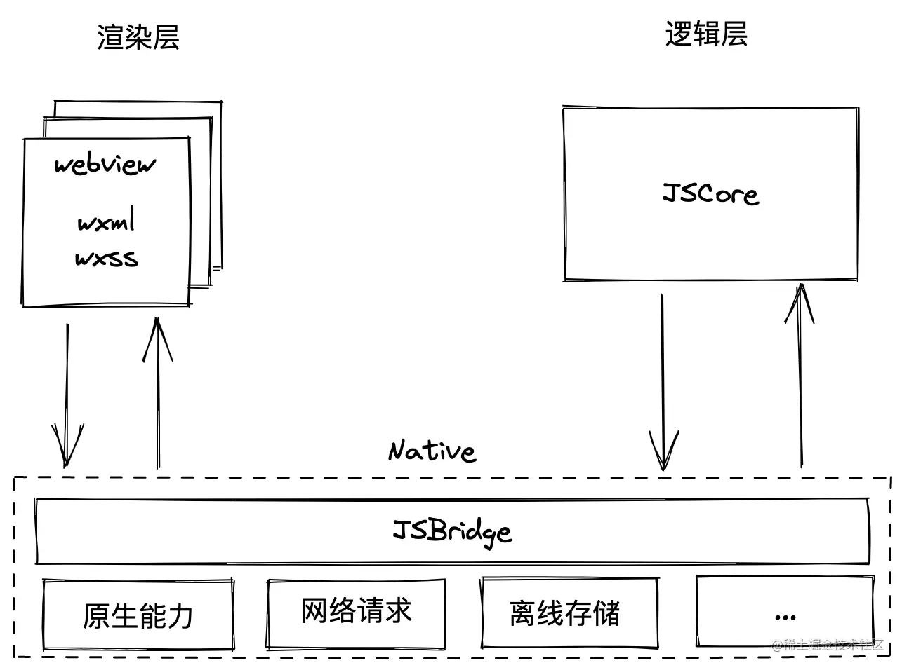
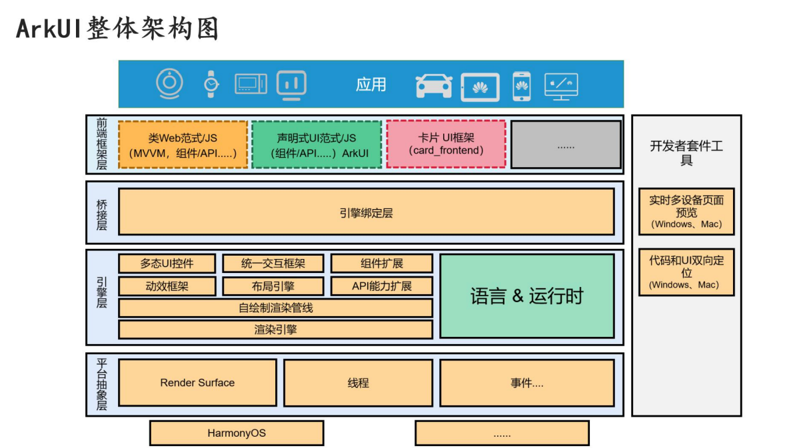
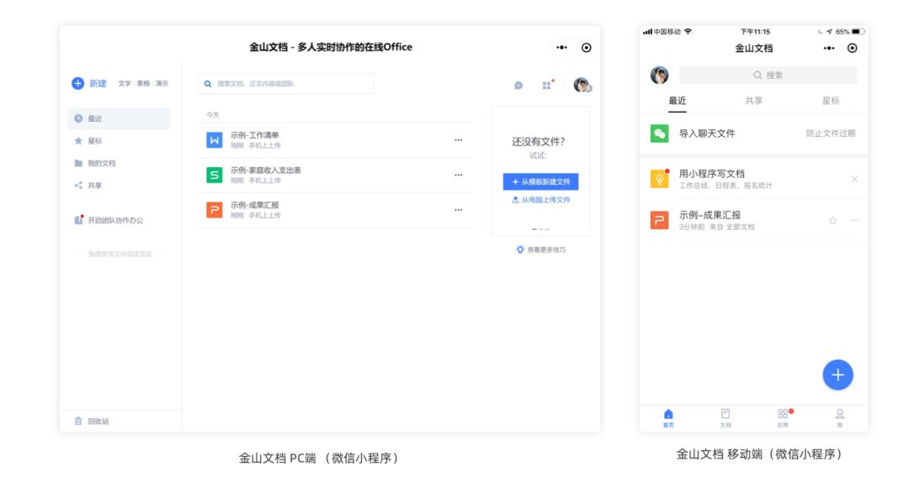
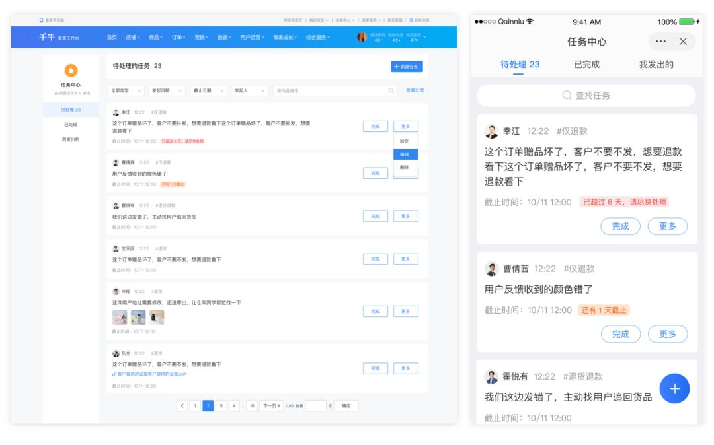
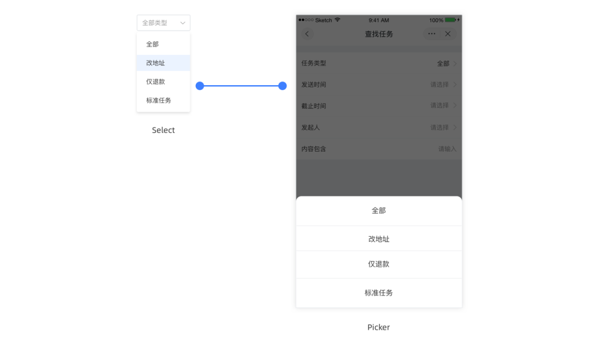
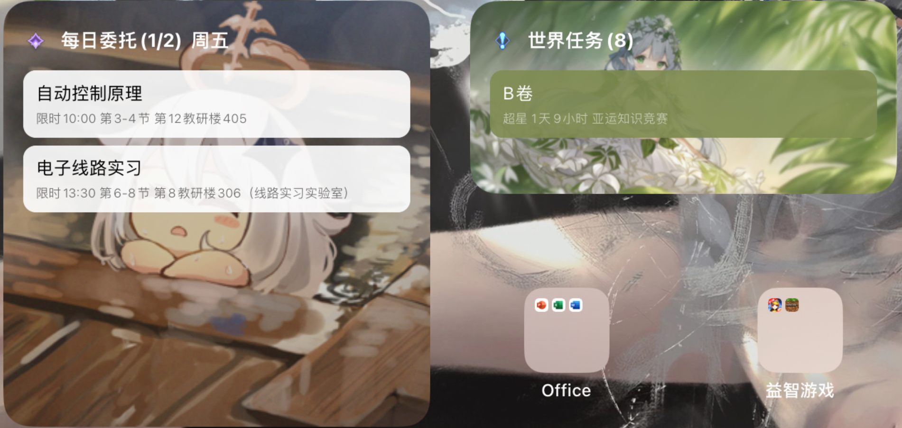

# 附录 3：跨端开发

> 人文+技术+经验

# 何为跨端：孙行者、者行孙
简单来说，就是一套代码，能在多个平台上跑。
> 孙行者，行者孙，者孙行.......者行孙，孙者行，行孙者

例如，你可以编写一套前端代码，然后在Web、HarmonyOS、OpenHarmony、Android、Ios、Macos、Linux、Windows、小程序（微信、QQ、抖音、支付宝...）上运行。

# 为何跨端：三生三世皆为你
随着业务的发展，产生了越来越多的业务场景，同时随着技术的发展，产生了 越来越多的端，PC 端(Windows、Mac) ，移动端(安卓、iOs)、web端、loT 设备(车载设备、手表)等。 但是，很多互联网企业制作应用时，往往需要使应用支持多个系统，但是每个系统的应用功能也需保持一致。为此，传统做法是各端安排研发人员进行开发相同功能。这不仅造成了资源冗余、浪费，开发、维护的成本也特别高。通常情况下，开发的周期也是比较长的。 新兴企业往往难以投入很多人力、资金到这部分。他们往往喜欢一个岗位干多份事情：既让你会app开发，又要你开发小程序，web页面，还要让你自己干全栈。 这时候，跨端就很好的解决了这方面的难题。 在现代化前端发展的过程中，跨端领域也正逐渐火热。 就比方说，现如今，桌面端QQ已经全面基于前端跨端方式开发，例如MacOS QQ、Linux QQ、Win QQ（还在内测）。 我们市场上也能看到很多耳熟能详的应用他们都是基于前端跨端开发的：Steam桌面版、钉钉、VsCode等。

## 优点

1. 研发效率高：学习成本低、多端一致性高
2. 用户体验好：稳定性好、性能体验好
3. 动态化：支持动态化下发，满足日益增长的业务需求

# 如何跨端：港通天下
跨端其实不是一个新兴的名词。跨端又称跨平台。这其实很多语言都非常崇拜跨平台概念，原生支持跨平台。例如JAVA语言，它不仅可以开发安卓应用、其他操作系统的应用都可以开发。例如微软的.NET，为跨平台而生。 那么，前端如何实现的跨端呢？ 当你问这个问题的时候，是否注意到一件事：web前端原本就是跨平台的，跨端的。我们编写一套前端网页的代码，然后这个网页就能够通过手机各种系统、电脑各种系统通过浏览器访问。这不就已经跨平台、跨端了嘛？ 是不是很奇妙？欸，这时候又有小伙伴要问了：那既然已经实现了跨端，那下面的内容不就没啥用了吗，我们为啥要学跨端呢？ 其实不然。浏览器在移动设备上岂能和App相比。对于企业来说，一个App相比于网站，更能让用户产生粘性，留住用户，提高市场占有率。这就像移动端的哔哩哔哩，硬是要你用他家的App，否则就没有优秀的体验可言。 废话不多说，来看看主要技术方案。

## 方案简述
如果，让你思考如何让web代码支持跨平台，你会怎么做呢？ 以下是简单的思路：

1. 各个平台的容器能够运行这一套web代码。
2. web代码编译成各个平台能使用的代码，然后再编译成相应软件。
3. ...

现有的技术方案如下：

| 技术方案 | 视图层 | 优点 | 缺点 | 实践 |
| --- | --- | --- | --- | --- |
| hybrid方案 | webview |  1. 开发成本低 2. CSS全集 3. 一致性好 4. 生态最好  |  1. 性能中等  |  1. 浏览器 2. Electron  |
| 原生渲染方案 | 原生组件 |  1. 性能好  |  1. CSS子集 2. 一致性一般  |  1. React Native  |
| 自渲染方案 | Skia |  1. 性能最好 2. 一致性最好  |  1. CSS子集 2. 开发成本高 3. 生态一般  |  1. Flutter  |
| 小程序方案 | webview+原生组件 |  1. 开发成本低 2. CSS全集 3. 一致性好  |  1. 生态一般  |  1. 微信小程序  |

### Hybrid方案
简单理解，就是浏览器套壳。 它是基于WebView渲染，通过JS Bridge 把一部分系统能力开放给JS调用。  WebView容器的工作原理是基于Web技术来实现界面和功能，通过将原生的接口封装、暴露给JavaScript调用，JavaScript编写的页面可以运行在系统自带的WebView中。这样做的优势是，对于前端开发者比较友好，可以很快地实现页面跨端，同时保留调用**原生的能力**，通过搭建桥接层和原生能力打通。但这种设计，跨端的能力受限于桥接层，当调用之前没有的原生能力时，就需要增加桥。另外，浏览器内核的渲染独立于系统组件，无法保证原生体验，**渲染的效果会差不少**。

#### 浏览器
浏览器就是一种历史悠久的跨平台方案。 网页跨平台不意味着浏览器也是跨平台的，浏览器的可执行文件还是每个平台单独开发和编译的，但是他们支持的网页解析逻辑一样，这样上面跑的网页就是跨平台的。 浏览器提供了一个容器，屏蔽了底层差异，提供了统一的 api（dom api），这样就可以实现同一份代码跑在不同平台的统一的容器里。这个容器叫做浏览器引擎，由 js 引擎、渲染引擎等构成。 

#### PWA
尽管PWA的出现不是为了“跨端”，但他们对于“跨端”的天然支持，能够让一套代码运行在PC、移动两端，就再一次产生了跨端设计实施的可能性。
> 小程序的“鼻祖“，但如今在国内已消亡。

PWA（Progressive Web App）是一个基于web技术构建的应用，并具备了像原生应用一样的体验、性能以及功能。它通过使用Service Worker缓存静态资源实现离线可访问，提高网页加载速度并且通过添加到主屏幕来给用户带来更好的体验。 PWA 是 Google 于 2016 年提出的概念，于 2017 年正式落地，于 2018 年迎来重大突破，全球顶级的浏览器厂商，Google、Microsoft、Apple 已经全数宣布支持 PWA 技术。 纵观现有 Web 应用与原生应用的对比差距，如**离线缓存、沉浸式体验**等等，可以通过已经实现的 Web 技术去弥补这些差距，最终达到与原生应用相近的用户体验效果。 **PWA=WEB网页+离线缓存+消息推送**
> 在 2017 年 7 月 5 日“百度 AI 开发者大会”（Baidu Create2017）——Web 生态分论坛上，百度开发者介绍了百度 Lavas 解决方案，帮助开发者快速搭建 PWA 应用。
> lavas 不是一个框架，而是一个基于 vue 的 PWA 解决方案，通过 lavas 导出的模板帮助开发者解决了接入 PWA 过程中遇到的问题：
> - Service Worker 生成
> - Service Worker 更新，以及 sw 更新后的操作
> - App Skeleton，页面渲染完成之前的页面框架
> - 页面切换前进后退过渡动画
> - App Shell，集成了 vuetify 组件库
> - 主题切换
> - vue 的图标解决方案...
> 
而现在 lavas 官网已经无法访问，这在很大程度上可以反应 PWA 在国内业务的一个现状。

#### Electron
 Electron 是使用 JavaScript，HTML 和 CSS 构建跨平台的桌面应用程序的框架，可构建出兼容 Mac、Windows 和 Linux 三个平台的应用程序。 Electron 的跨端原理并不难理解：它通过集成浏览器内核，使用前端的技术来实现不同平台下的渲染，并结合了 Chromium 、Node.js 和用于调用系统本地功能的 API 三大板块。

- Chromium 为 Electron 提供强大的 UI 渲染能力，由于 Chromium 本身跨平台，因此无需考虑代码的兼容性。最重要的是，可以使用前端三板斧进行 Electron 开发。
- Chromium 并不具备原生 GUI 的操作能力，因此 Electron 内部集成 Node.js，编写 UI 的同时也能够调用操作系统的底层 API，例如 path、fs、crypto 等模块。
- Native API 为 Electron 提供原生系统的 GUI 支持，借此 Electron 可以调用原生应用程序接口。

### 原生渲染方案
使用JS开发，通过中间层桥接后使用原生组件来渲染UI界面。例如，在Android开发中是使用Kotin或Java来编写视图;在iOS开发中是使用Swift或Objective-C来编写视图。

#### React Native
React Native 是一个由 Facebook 于2015年9月发布的一款开源的 JavaScript 框架，它可以让开发者使用 JavaScript 和 React 来开发跨平台的移动应用。  React Native 的思路是最大化地复用前端的生态和 Native 的生态，和 WebView 容器的最大区别在于 View 的渲染体系。React Native 抛弃了低效的浏览器内核渲染，转而**使用自己的 DSL 生成中间格式**，然后映射到对应的平台，**渲染成平台的组件**。相对 WebView 容器，体验会有一定的提升。不过，渲染时需要 JavaScript 和原生之间通信，在有些场景可能会导致卡顿。另外就是，渲染还是在Native层，要求开发人员对Native有一定的熟悉度。

### 自渲染方案
简单来说，就是既不使用webview又不使用原生组件，而是使用自绘组件。

#### Flutter
flutter 是近些年流行的跨端方案，跨的端包括安卓、ios、web 等。它最大的特点是渲染不是基于操作系统的组件，而是直接基于绘图库（skia）来绘制的，这样做到了渲染的跨端。 Flutter与上述Recat Native、WebView容器本质上都是不同的，它没有使用WebView、JavaScript解释器或者系统平台自带的原生控件，而是有一套自己专属的Widget，底层渲染使用自身的高性能C/C++ 引擎自绘。

### 小程序方案
使用小程序DSL + JS开发，通过中间层桥接后调用原生能力，使用webview来渲染UI界面。 从小程序的定位来讲，它就不可能用纯原生技术来进行开发，因为那样它的编译以及发版都得跟随微信，所以需要像Web技术那样，有一份随时可更新的资源包放在远程，通过下载到本地，动态执行后即可渲染出界面。 但如果用纯web技术来开发的话，会有一个很致命的缺点那就是在 Web 技术中，UI渲染跟 JavaScript 的脚本执行都在一个单线程中执行，这就容易导致一些逻辑任务抢占UI渲染的资源，这也就跟设计之初要求的快相违背了。 因此微信小程序选择了Hybrid 技术，界面主要由成熟的 Web 技术渲染，辅之以大量的接口提供丰富的客户端原生能力。同时，每个小程序页面都是用不同的WebView去渲染，这样可以提供更好的交互体验，更贴近原生体验，也避免了单个WebView的任务过于繁重。 微信小程序是以webview渲染为主，原生渲染为辅的混合渲染方式。 小程序的架构模型有别与传统web单线程架构，小程序为双线程架构。 微信小程序的渲染层与逻辑层分别由两个线程管理，渲染层的界面使用 webview 进行渲染；逻辑层采用 JSCore运行JavaScript代码。 

# 类前端开发：拿过来吧你
现代的客户端开发平台继承和发扬了Web的HTML语言的方式来构建表现层开发平台，其中有代表性的是XAML，Flex，JavaFX，Android几个平台。他们都使用基于XML的描述性语言作为开发语言，并且提供可视化的开发环境，使用一种强类型的程序设计语言作为背后支撑。完成表现层开发工作的前端开发人员只需要熟练掌握表现层开发语言极其机制，熟练使用表现层开发工具，少量掌握背后的程序设计语言就可以很好地完成表现层开发工作。主要原因是基于XMl的方式设计UI，可以使得视图层和逻辑层进行一个分离，更清晰、更灵活。XML可以进行一个可视化开发，门槛低，易上手。 因此，有许多语言都采用类前端的方式进行视图层的开发，然后其他语言进行逻辑层的开发。

## .NET
微软的.NET 就是基于XAML开发视图层，支持可视化开发（低代码）。

## 鸿蒙ArkTs
基于JS扩展的类Web开发范式的方舟开发框架包括应用层（Application）、前端框架层（Framework）、引擎层（Engine）、平台适配层（Porting Layer） JS UI框架采用类HTML和CSS Web编程语言作为页面布局和页面样式的开发语言，页面业务逻辑则支持ECMAScript规范的JavaScript语言。JS UI框架提供的类Web编程范式，可以让开发者避免编写UI状态切换的代码，视图配置信息更加直观。 

# 跨端不只是跨端：爱你的全世界

## 什么样的场景可以跨端？
跨端应用能够真正推进下去，除了有技术保障外，还需要合适的需求场景，使用PC端的功能型产品主要是需要大屏带来的“效率”（办公、个人管理、教育）与“沉浸”（数据、金融、游戏、影视）体验。   依赖PC、移动双端进行经营管理的电商场景，也有很多内容适合跨端。

## 跨端UI如何设计
跨端的UI设计不仅仅是响应式，布局没问题就行，而是从PC端“网页”到移动端“App”的体验映射。

1. 双端基础组件设计规则对齐（对前端来说是同类组件API、属性对齐以及组件功能形态映射）

 Select对应Picker

2. 布局响应规则（行列变化，聚合变化等）；

 卡片布局的一种聚合变化

3. 交互形态响应规则（导航、交互模式等）;

 表单型弹窗对应新页面

4. 不同场景的跨端策略，例如Dashboard页面的跨端应保证用户在首屏快速获取关键信息，下图的Bootstrap模板是一个错误示例，移动端的布局方式浪费首屏空间，降低用户获取关键信息的效率。

 Mobile first 不是唯一准则。进行具体场景的跨端设计时，我们会从两端场景出发重新对比分析用户的需求差异，明确体验的增强点与折损点。特别是电商中后台场景中：有些业务中用户的主阵地并不是在移动端，而是PC端，比如用户运营策略的设置；有些是两端分别承载不同的场景需求，比如任务的处理。

# 高效开发++：人的生命是有限的

## 前后端不分离
当我们开始进行跨端开发的时候，我们会遇到一个很尴尬的问题。比如，我们要开发一个客户端或者说APP，利用前端跨端技术开发。此时，我们不得不既要开发前端，又要涉及后端的部分内容。例如，获取相关数据之类的。此时，我们使用前后端分离的方式，在某些情境下就有可能不妥。尤其是仅个人开发，已经有代码洁癖，又要前后端分离，那显然是一种不明智的开发方式。所以，很多情况下，进行一个前后端不分离的方式开发前后端，或许是一个好的方法。

## Serveless
简而言之，就是**云函数（分布式）+云数据库（分布式）**。 Serverless字面意思是无服务，但并不代表再也不需要服务器了，而是指开发者不需要过多的考虑服务器的问题，计算资源作为服务出现而不是服务器的概念出现。 那么Serverlss，是对全部底层资源和操作的封装，让开发者专注于业务逻辑。  Serverless = Faas (Function as a service) + Baas (Backend as a service) FaaS（Function-as-a-Service）是服务商提供一个平台、提供给用户开发、运行管理这些函数的功能，而无需搭建和维护基础框架，是一种事件驱动由消息触发的函数服务 BaaS（Backend-as-a-Service）后端即服务，包含了后端服务组件，它是基于 API 的第三方服务，用于实现应用程序中的核心功能，包含常用的数据库、对象存储、消息队列、日志服务等等。

### 适用场景
Serverless 带来的其实是前端研发模式上的颠覆。相对以往纯前端研发的方式，Serverless 屏蔽底层基础设施的复杂度，后台能力通过FaaS平台化，我们不再需要关注运维、部署的细节，开发难度得到了简化，前端开发群体的边界就得以拓宽，能够参与到业务逻辑的开发当中，更加贴近和理解业务，做更有价值的输出。

- 场景1: 负载有波峰波谷

波峰波谷时，机器资源要按照峰值需求预，比如医院挂号这需求，假设在每天10点放号预约，那10点就会有峰值的出现，为了这个峰值并发的考虑，准备了相对应性能（固定）的服务器，然而在波谷时机器利用率又明显下降，不能进行资源复用导致浪费，而serverless不用为了波峰去做准备，不用留住水位，支持弹性缩扩容，在你高峰时再在进行动态扩容

- 场景2: 定时任务（报表统计等）

服务空闲时间来处理批量数据，来生成数据报表，通过Serverless方式，不用额外购买利用率并不高的处理资源，比如每日的凌晨，分析前一天收集的数据并生成报告

- 场景3: 小程序开发（云开发）

比如微信小程序开发m在实际开发中，如果我们不用云开发的openid获取流程，而用传统的方式，你就知道openid的获取是非常繁琐的一个过程，前端需要通过wx.login获取一个code值（具有时效性）再通过code值去后台用appsecret去调取openid。

### 特点

#### 事件驱动

- 云函数由事件驱动，即事件触发函数
- Serverless 应用不会类似于原生的[监听 - 处理] 类型的应用一直在线，而是按需启动
- 事件的定义可以很丰富，一次 http 请求，一个文件上传，一次数据库记录修改，一条消息发送等等都可以被定义为事件

#### 单事件处理

- 触发启动的一个云函数实例，一次只处理一个事件
- 无需在代码内考虑高并发高可靠性，可以专注于业务
- 通过云函数实例的高并发能力，实现业务高并发

#### 自动弹性压缩

- 由于云函数事件驱动及单事件处理的特性，云函数通过自动的伸缩来支持业务的高并发
- 针对业务的实际事件或请求数，云函数自动弹性合适的处理实例来承载实际业务量
- 在没有事件或请求时，无运行实例，不占用资源

#### 无状态开发

- 云函数运行时根据业务弹性，可能伸缩到 0，无法在运行环境中保存状态数据
- 分布式开发中，均需要保持应用的无状态，以便以水平伸缩
- 可以利用外部服务、产品，例如数据库或缓存，实现状态数据的保存

# 理论结束 现在进入实践教学

## uniapp实战
uni-app 是一个使用 Vue.js 开发所有前端应用的框架，开发者编写一套代码，可发布到iOS、Android、Web（响应式）、以及各种小程序（微信/支付宝/百度/头条/飞书/QQ/快手/钉钉/淘宝）、快应用等多个平台。 开发者按uni-app规范编写代码，由编译器将开发者的代码编译生成每个平台支持的特有代码：

- 在web平台，将.vue文件编译为js代码。与普通的vue cli项目类似
- 在微信小程序平台，编译器将.vue文件拆分生成wxml、wxss、js等代码
- 在app平台，将.vue文件编译为js代码。进一步，如果涉及uts代码：
   - 在Android平台，将.uts文件编译为kotlin代码
   - 在iOS平台，将.uts文件编译为swift代码

1. 区分页面和组件的区别：页面和组件的生命周期
2. 云函数、云数据库
3. 设计稿转代码（[https://ide.code.fun/projects/619b7f3804575d001169ac66/pages/6442c187b98f5d001164a6a4](https://ide.code.fun/projects/619b7f3804575d001169ac66/pages/6442c187b98f5d001164a6a4)）

## vitesse-lite-py实战
[https://github.com/MarleneJiang/vitesse-lite-py](https://github.com/MarleneJiang/vitesse-lite-py)

1. 域间通信
2. laf云函数
3. 设计稿转代码（[https://ide.code.fun/projects/619b7f3804575d001169ac66/pages/6442c187b98f5d001164a6a4](https://ide.code.fun/projects/619b7f3804575d001169ac66/pages/6442c187b98f5d001164a6a4)）

## electron实战

1. Frameless：桌面端不仅仅只有方框矩形，而是想你所想。

 @AsakiRain

# 参考作业
尝试使用某种跨端框架和云函数，实现一个查看课表应用，形式不限。推荐使用hdu-lis包拿到数据。 

# 参考
